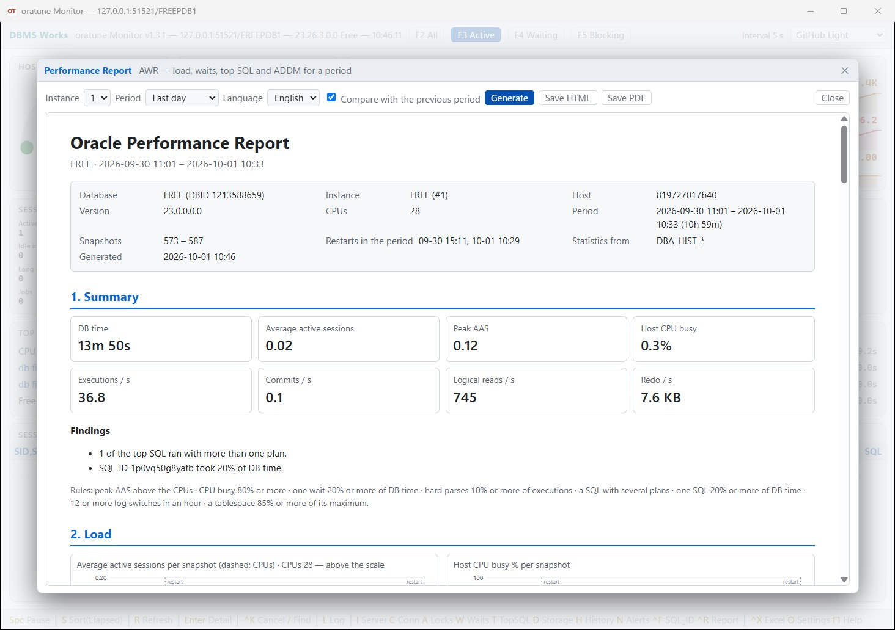
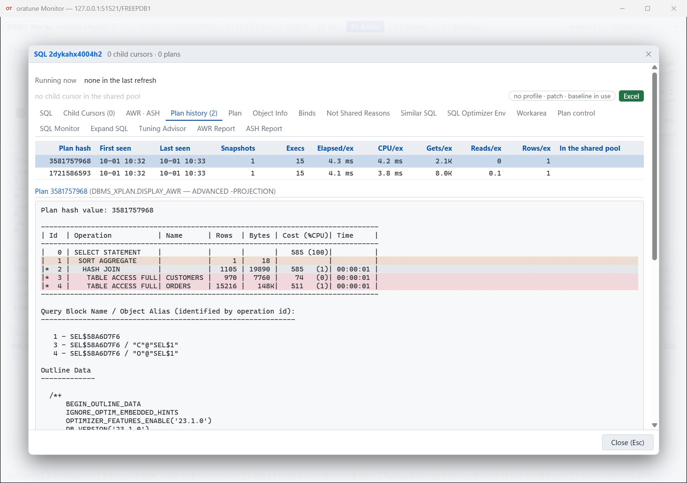

# oratune — Oracle 실시간 모니터 (무료)


**[최신 배포본 내려받기](https://github.com/Doni-Kim/oratune-release/releases/latest)** ·
[English](README.md) · [매뉴얼 (HTML)](oratune.html)

Oracle Database 상태를 실시간으로 보는 데스크톱 모니터입니다. 창 하나 · 실행 파일 하나이고, 서버에는 아무것도 설치하지 않고
PC 에 Oracle 클라이언트도 필요 없습니다 — 관리 코드 드라이버가 들어 있고, 동적 성능 뷰만 읽습니다. 부담 없이 쓰시라고 공유드립니다.

## 화면

| 실시간 대시보드 | Top SQL |
|---|---|
|  |  |

| Blocked Chain | 세션 상세 |
|---|---|
|  |  |

| 실행 계획 | History |
|---|---|
|  |  |

| Waits | 알림 |
|---|---|
|  |  |

| 성능 보고서 | Plan history |
|---|---|
|  |  |

그림은 시험용 DB 의 임시 `shop` 스키마 장면입니다.

## 설치·설정

- 압축을 풀고 폴더째 두고 `oratune.exe` 를 실행합니다(단일 파일).
- .NET 설치도, Oracle 클라이언트도 필요 없습니다 — 둘 다 실행 파일 안에 있습니다.
- 준비할 것은 실행 파일 옆의 접속 파일 하나입니다. zip 에 `oratuneNode1.json` · `oratuneNode2.json` 두 개가 있습니다 — 서버 하나에 파일 하나.
  서버가 하나면 하나를 지우세요. 파일을 고치거나(아래) 그냥 실행하면 — 붙지 못할 때 값이 채워진 접속 창이 뜹니다.
  붙은 뒤에 입력한 값을 파일에 저장합니다(비밀번호는 암호화).

## 주요 기능

- **실시간 대시보드** — Host CPU · 세션(한도 대비) 게이지, Trend 6(왼쪽은 들어온 일 AAS · Exec/s · Temp, 오른쪽은 그 대가 LIO · PIO · Redo),
  Sessions 8칸(Active · Blocked · Idle in tx · Parallel · Long ops · Background · Jobs · Killed), 초당 Performance 18칸, Top Waits, 세션 목록.
  Exadata 에서는 Trend · Performance 가 스토리지 셀 지표로 바뀝니다.
- **Blocked Chain** — Locks(`A`)가 `V$WAIT_CHAINS` 로 누가 누구를 막는지 트리로(RAC 전체를 한 번에). `F5` 는 막는 세션과 막힌 세션만,
  Connections(`C`)는 트랜잭션을 연 채 쉬는 세션을 따로.
- **세션 상세**(`Enter`) — 문장 · 실제로 도는 계획 · 대기 · 락 · 열린 트랜잭션. `Ctrl+K` 문장 취소(18c+) · 세션 Kill, `Ctrl+X` 세션 Excel.
- **SQL 창** — 세션 · Top SQL · `Ctrl+F`(SQL_ID) 어디서 열어도 같은 모양: Child Cursors, 줄 색이 있는 실행 계획,
  AWR 의 계획 이력(Plan history), Object Info(SQL 이 쓰는 테이블 전부 — 컬럼 형 · 인덱스를 못 타게 하는 형 변환 · 인덱스 · 파티션 · 압축 · 통계와 수집 이력),
  Binds(값을 박은 문장 · DECLARE 블록), Not Shared Reasons, 리터럴만 다른 문장(Similar SQL), SQL Optimizer Env, Workarea,
  Plan control(PURGE 스크립트 · 계획 고정 스크립트 — Baseline · SQL Patch · SQL Profile), Expand SQL, 이 SQL_ID 의 AWR · ASH 보고서. `[Excel]` 로 한 권에.
- **성능 보고서**(`Ctrl+R`, Diagnostics Pack) — AWR 의 한 기간을 HTML · PDF 한 파일로, 영어 · 한국어: 요약과 자동 소견 · 부하 그래프 · 대기 · Top SQL ·
  시간별 ASH · 자원 · 저장소 증가 · ADDM 소견 · 직전 같은 길이 구간과 비교.
- **패널** — Server(`I`) · Connections(`C`) · Locks(`A`) · Waits(`W`) · Top SQL(`T`, Δ 모드) · Storage(`D`).
- **알림 11종** — 세션 한도 · AAS 가 코어 수 초과 · Host CPU · 대기 세션 · Lock chain · Idle in transaction · 오래 도는 문장 · 테이블스페이스 · Temp · Undo · Recovery area, 임계값은 직접.
- **History** — `L` 로 로컬 SQLite 에 기록하고 `H` 로 메인 화면의 모든 값과 그 시각의 세션을 되짚어 봅니다.
- **Admin Reference** — `F1` 의 둘째 탭. DBA 가 찾는 패키지 · 명령문 약 380개의 설명과 복사할 샘플.
- **설정 화면**(`O`) · **테마 12종** · 접속이 끊기면 스스로 다시 붙습니다.

함께 든 `oratune.html` 이 그림이 있는 전체 매뉴얼입니다.

## Diagnostics · Tuning Pack

Diagnostics · Tuning Pack 이 필요한 기능(ASH · AWR · SQL Monitor · SQL Tuning Advisor)은 **기본 꺼짐**이고,
꺼져 있는 동안 그 뷰에는 쿼리를 한 번도 보내지 않습니다 — 조회만 해도 `DBA_FEATURE_USAGE_STATISTICS` 에 흔적이 남기 때문입니다.
팩을 가진 경우에만 접속 파일에서 켜세요:

```json
"packs": { "diagnostics": false, "tuning": false }
```

## 지원 범위 · 제약사항

- **Windows 전용**입니다. 화면이 웹 기반(Blazor Hybrid)이라 Linux · macOS 에서는 돌지 않습니다.
- **Oracle 12.2 이상** — 단일 인스턴스 · RAC · CDB/PDB(붙은 컨테이너만 봅니다). 26ai · 12.2 에서 확인했습니다.
  RAC · Exadata · 자체 세션 한도를 둔 PDB 는 실제 환경에서 확인하지 못했습니다.
- ConfuserEx(무료 도구)로 난독화했습니다 — 강한 보호는 기대하지 마세요.

## 모니터링 전용 계정

```sql
CREATE USER oramon IDENTIFIED BY "...";
GRANT CREATE SESSION TO oramon;
GRANT SELECT_CATALOG_ROLE TO oramon;   -- V$ · GV$ · DBA_ 뷰
GRANT ALTER SYSTEM TO oramon;          -- 선택: Ctrl+K (문장 취소 · 세션 Kill)
GRANT ADVISOR TO oramon;               -- 선택, Tuning Pack 이 있을 때만: SQL Tuning Advisor
GRANT EXECUTE ON SYS.DBMS_WORKLOAD_REPOSITORY TO oramon;  -- 선택, Diagnostics Pack 이 있을 때만: SQL 창의 AWR Report · ASH Report
```

26ai 에서 이 권한 그대로 모든 화면을 확인했습니다. 예외는 **Expand SQL** 하나입니다 — 모니터링 계정으로 문장을 다시 파싱하므로
문장이 읽는 테이블에 대한 `SELECT` 가 필요합니다(테이블마다 GRANT, 또는 `SELECT ANY TABLE`). 없으면 그 탭만 ORA-00942 를 보이고 나머지는 그대로입니다.

## WebView2 런타임

oratune 은 Microsoft Edge WebView2 런타임으로 창을 그립니다. 런타임이 없으면 시작할 때 그렇게 알리고 끝납니다.
Windows 11 에는 들어 있고 Windows 10 도 대부분 들어 있습니다. Windows Server 는 따로 설치해야 하는 경우가 많습니다 —
https://developer.microsoft.com/microsoft-edge/webview2/ 의 "Evergreen Standalone Installer"(`MicrosoftEdgeWebView2RuntimeInstallerX64.exe`).

## 문제가 생기면

오류는 실행 파일 옆 `oratune.log` 에 남습니다(문제가 있을 때만 생깁니다).

- **버그 · 질문** — [issue](https://github.com/Doni-Kim/oratune-release/issues) 로 남겨 주세요.
  로그는 거기 붙이지 마세요 — 비밀번호는 없지만 서버 주소와 SQL 이 들어 있을 수 있습니다.
- **로그 파일**이나 공개로 올리기 싫은 것은 **doniikim@gmail.com** 으로 보내 주세요.

## 기술 스택

- .NET 11.0 (x64), C# 15, Blazor Hybrid
- Oracle.ManagedDataAccess.Core(ODP.NET Core — Oracle Free Distribution, Hosting, and Use Terms 에 따라 수정 없이 재배포) ·
  Microsoft.Data.Sqlite · ClosedXML · Hogimn.Sql.Formatter · Microsoft.Web.WebView2 · Microsoft.AspNetCore.Components.WebView.WindowsForms
- 함께 배포하는 구성 요소의 저작권 고지와 라이선스 전문: [THIRD-PARTY-NOTICES.txt](THIRD-PARTY-NOTICES.txt) (zip 에도 있습니다)

## 접속 파일 예시 (`oratuneNode1.json` …)

서버 하나에 파일 하나, 이름은 자유입니다(`prod.json` · `dev.json` …). 실행 파일 옆에 둘 이상이면 시작할 때 고르는 창이 뜹니다.
고른 파일이 그 실행의 설정입니다 — 암호화한 비밀번호 · 창 위치 · 테마가 거기 저장됩니다.

```json
{
  "databases": [
    {
      "userId": "oramon",
      "password": "change-me",
      "server": "127.0.0.1",
      "port": "1521",
      "serviceName": "ORCLPDB1",
      "encryption": "accepted"
    }
  ],
  "interval": 5
}
```

- `password` 는 평문으로 적으면 처음 실행할 때 암호화해 다시 저장합니다.
- `serviceName` 을 권합니다. `sid` 는 옛 방식, `dataSource` 는 tnsnames 별칭 · SCAN 주소 · 서술자 통째.
- `encryption` 은 Oracle Native Network Encryption: `accepted`(기본) · `rejected` · `requested` · `required`.
- `interval` 은 수집 주기(초), 3 ~ 60(없으면 5). zip 의 `oratune_sample_kr.json` 에 모든 설정의 설명이 있습니다.

## 사용 조건

업무든 개인이든 자유롭게 쓰셔도 됩니다. 실행 파일 재배포와 리버스 엔지니어링은 삼가 주세요.
소스는 공개하지 않습니다.

## 연락처

DBMS Works — **doniikim@gmail.com**

Oracle → PostgreSQL / MySQL 마이그레이션, DB 성능 튜닝 문의도 받습니다.
