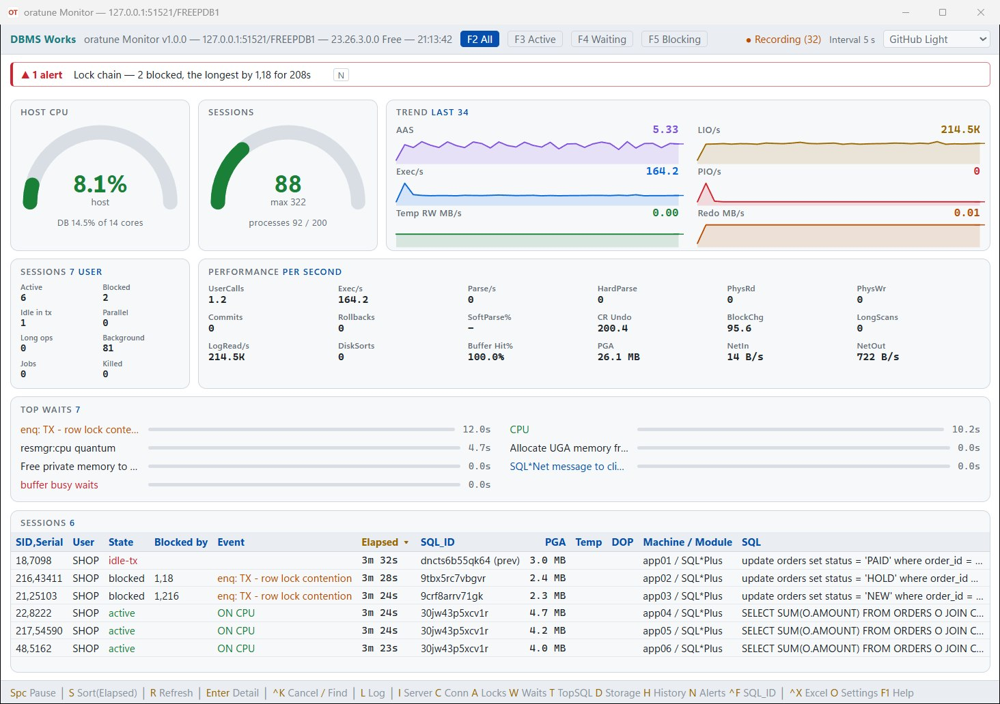
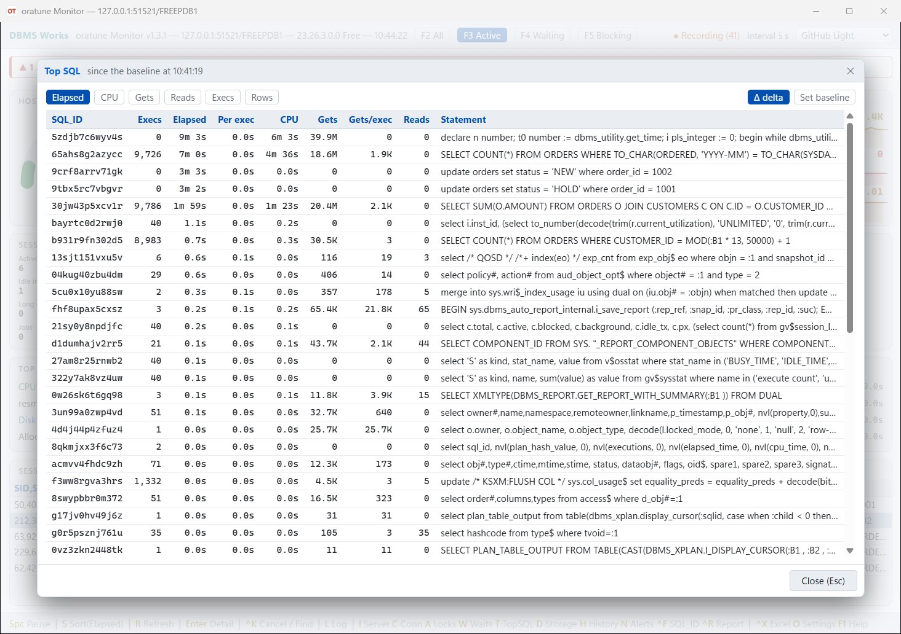
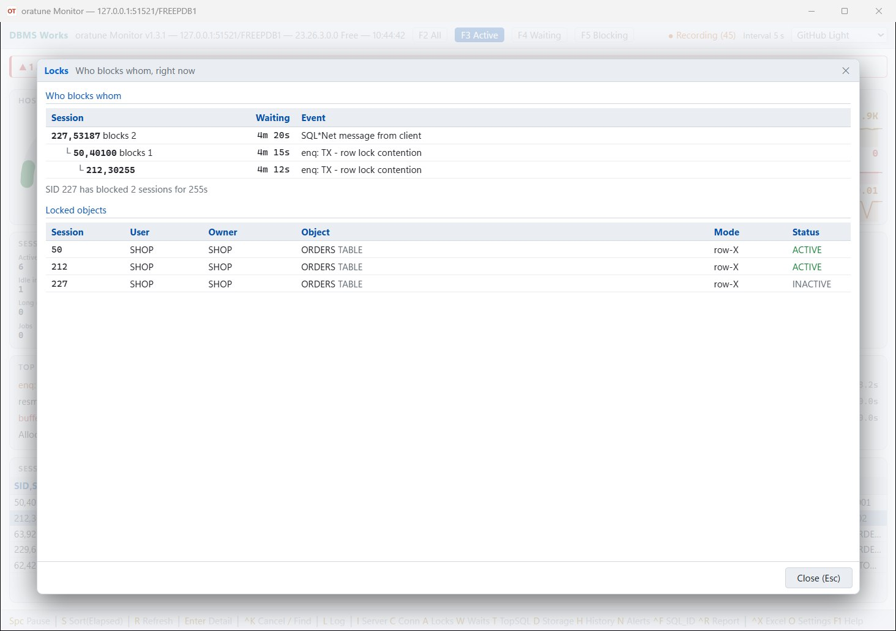
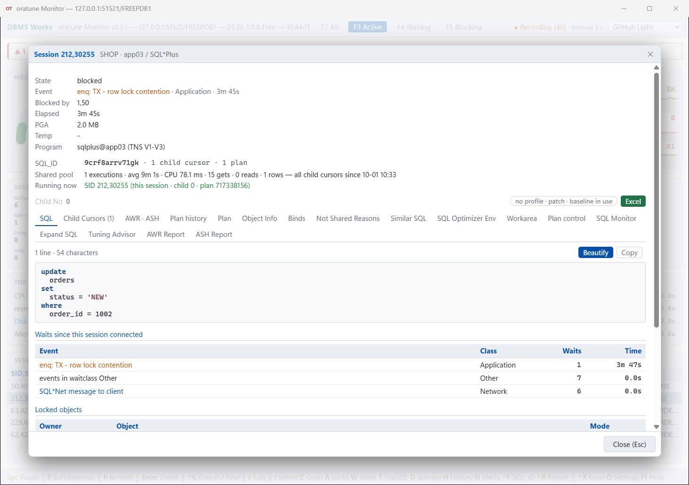
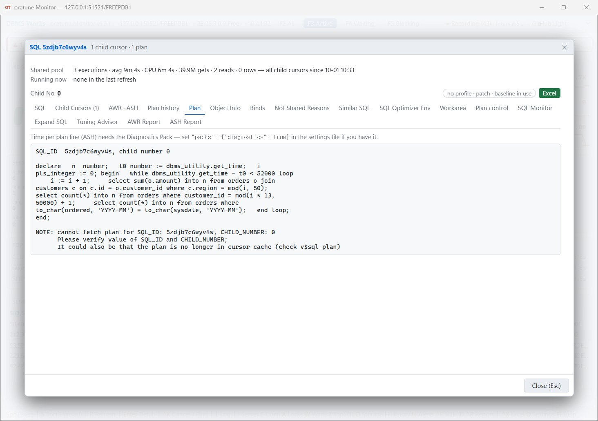
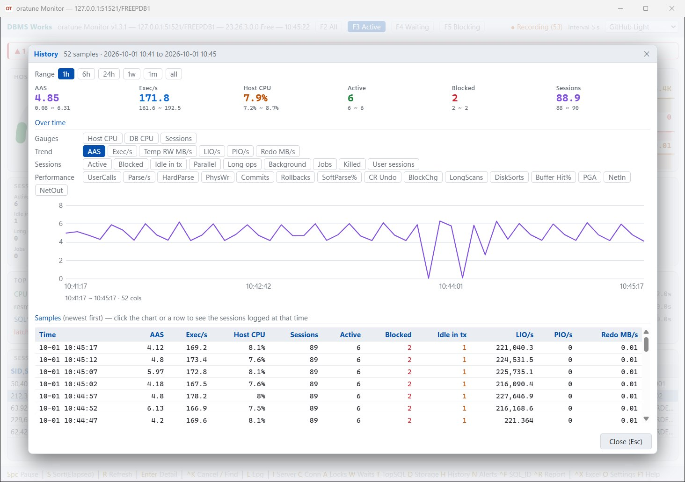
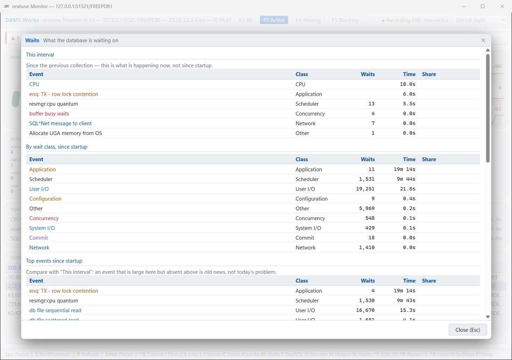
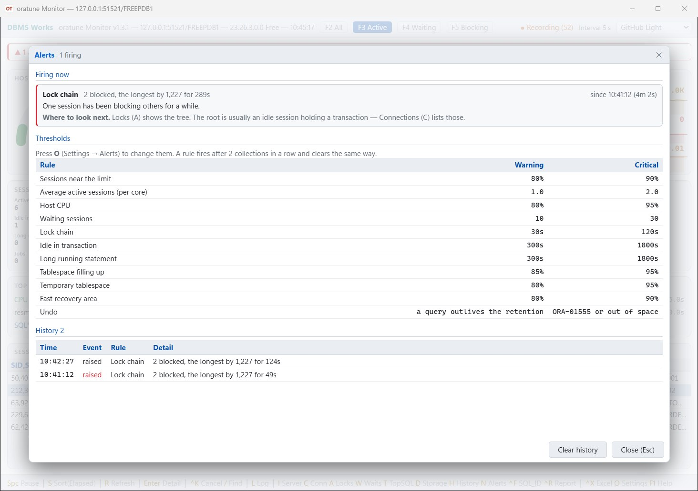

# oratune — a real-time Oracle monitor (free)


**[Download the latest release](https://github.com/Doni-Kim/oratune-release/releases/latest)** ·
[한국어 설명](README.ko.md) · [Manual (Korean, HTML)](oratune.html)

oratune is a desktop monitor for Oracle Database. One window, one executable, nothing to install on the server and no
Oracle client on your PC — the managed driver is built in, and everything is read from the dynamic performance views.
Free to use, no strings attached.

## Screenshots

| Live dashboard | Top SQL |
|---|---|
|  |  |

| Blocked chain | Session detail |
|---|---|
|  |  |

| Execution plan | History |
|---|---|
|  |  |

| Waits | Alerts |
|---|---|
|  |  |

The screenshots show a throwaway `shop` schema on a test database.

## Install

- Unzip, keep the folder together, and run `oratune.exe` (single-file publish).
- No .NET install and no Oracle client needed — both are inside the executable.
- The only thing to set up is a connection file next to the executable. The zip ships two, `oratuneNode1.json` and
  `oratuneNode2.json` — one file per server. Watching a single server? Keep one and delete the other.
  Either edit it (see below), or just run `oratune.exe` — when the values do not connect, a connection dialog opens with
  them filled in. Once the connection has succeeded, what you typed is saved back (the password is stored encrypted).

## What it does

- **Live dashboard** — Host CPU and sessions against the limit (gauges); six trend graphs, the work that came in on the left
  (AAS, executions, temp I/O) and what it cost on the right (logical reads, physical reads, redo); eight session counters
  (active, blocked, idle in transaction, parallel, long ops, background, jobs, killed); eighteen per-second performance
  values; top waits, and the session list. On Exadata the trends and counters switch to the storage cells.
- **Blocked chain** — Locks (`A`) draws who blocks whom as a tree from `V$WAIT_CHAINS` (all RAC instances at once);
  `F5` shows blockers together with the sessions they block, and Connections (`C`) lists sessions idle with an open transaction.
- **Session detail** (`Enter`) — the statement, the plan it actually runs, waits, locks and the open transaction.
  `Ctrl+K` cancels the statement (18c+) or kills the session; `Ctrl+X` exports the session to Excel.
- **SQL window** — from a session, Top SQL, or `Ctrl+F` with a SQL_ID: child cursors, the plan with coloured lines,
  plan history from AWR, Object Info (every table the SQL uses — column types, implicit conversions that defeat an index, indexes, partitions,
  compression, statistics and their gathering history), binds (substituted into the statement or as a DECLARE block), not-shared reasons, optimizer
  environment, work areas, statements that differ only in literals, plan control with a PURGE script and scripts to fix a plan
  (baseline, SQL patch, SQL profile), Expand SQL, and the AWR and ASH reports for the SQL_ID. `[Excel]` writes it all to one workbook.
- **Performance report** (`Ctrl+R`, Diagnostics Pack) — a period of AWR as one HTML or PDF file, in English or Korean: summary with
  automatic findings, load charts, waits, top SQL, ASH by hour, resources, storage growth, ADDM findings and the previous period side by side.
- **Panels** — Server (`I`), Connections (`C`), Locks (`A`), Waits (`W`), Top SQL (`T`, with a delta mode), Storage (`D`).
- **Alerts** — 11 rules (sessions near the limit, AAS above the cores, host CPU, waiting sessions, lock chain, idle in
  transaction, long statements, tablespace, temp, undo, recovery area) with your own thresholds.
- **History** — press `L` to log every sample into a local SQLite file, then `H` to look back at every main-screen value
  and the sessions of any moment.
- **Admin Reference** — the second `F1` tab: about 380 packages and statements a DBA looks up, with samples to copy.
- **Settings screen** (`O`), **12 themes**, and it reconnects by itself when the connection drops.

The bundled `oratune.html` is the full manual with screenshots (in Korean).

## Diagnostics and Tuning Pack

Features that need the Oracle Diagnostics or Tuning Pack (ASH, AWR, SQL Monitor, SQL Tuning Advisor) are **off by default**,
and while off, oratune never queries those views — querying them alone leaves a trace in `DBA_FEATURE_USAGE_STATISTICS`.
Turn them on in the connection file only if you are licensed:

```json
"packs": { "diagnostics": false, "tuning": false }
```

## Requirements and limits

- **Windows only.** The UI is web-based (Blazor Hybrid), so it does not run standalone on Linux or macOS.
- **Oracle 12.2 or later** — single instance, RAC, CDB/PDB (oratune watches the container it is connected to).
  Checked on 26ai and 12.2. RAC, Exadata and PDBs with their own session limit have not been tried on real systems.
- The code is obfuscated with ConfuserEx — a free tool, so do not expect strong protection.

## A dedicated monitoring account

```sql
CREATE USER oramon IDENTIFIED BY "...";
GRANT CREATE SESSION TO oramon;
GRANT SELECT_CATALOG_ROLE TO oramon;   -- V$, GV$ and DBA_ views
GRANT ALTER SYSTEM TO oramon;          -- optional: Ctrl+K (cancel statement / kill session)
GRANT ADVISOR TO oramon;               -- optional, Tuning Pack only: SQL Tuning Advisor
GRANT EXECUTE ON SYS.DBMS_WORKLOAD_REPOSITORY TO oramon;  -- optional, Diagnostics Pack only: AWR Report and ASH Report in the SQL window
```

Checked with exactly these grants on 26ai: every screen works. The one exception is **Expand SQL** — it re-parses the
statement as the monitoring account, so it needs `SELECT` on the tables the statement reads (grant them per table, or
`SELECT ANY TABLE`). Without it that tab shows ORA-00942 and nothing else is affected.

## WebView2 Runtime

oratune draws its window with the Microsoft Edge WebView2 Runtime. When the runtime is missing, oratune says so at startup and exits.
It is built into Windows 11 and shipped to most Windows 10 machines; Windows Server often needs it installed separately —
use Microsoft's "Evergreen Standalone Installer" (`MicrosoftEdgeWebView2RuntimeInstallerX64.exe`) from
https://developer.microsoft.com/microsoft-edge/webview2/

## If something breaks

Errors are written to `oratune.log` next to the executable (the file only appears when something went wrong).

- **Bugs and questions** — open an [issue](https://github.com/Doni-Kim/oratune-release/issues).
  Please do not attach the log there: it holds no passwords, but it can contain server addresses and SQL text.
- **The log file**, or anything you would rather not post in public — mail it to **doniikim@gmail.com**.

## Built with

- .NET 11.0 (x64), C# 15, Blazor Hybrid
- Oracle.ManagedDataAccess.Core (ODP.NET Core, redistributed unmodified under the Oracle Free Distribution, Hosting, and Use Terms) ·
  Microsoft.Data.Sqlite · ClosedXML · Hogimn.Sql.Formatter · Microsoft.Web.WebView2 · Microsoft.AspNetCore.Components.WebView.WindowsForms
- Copyright notices and license texts of these bundled components: [THIRD-PARTY-NOTICES.txt](THIRD-PARTY-NOTICES.txt) (also inside the zip)

## Connection files (`oratuneNode1.json` …)

One file per server, any name works (`prod.json`, `dev.json` …). With two or more next to `oratune.exe`, oratune asks
which one to use at startup. The chosen file is that run's settings: the encrypted password, window position and theme are saved to it.

```json
{
  "databases": [
    {
      "userId": "oramon",
      "password": "change-me",
      "server": "127.0.0.1",
      "port": "1521",
      "serviceName": "ORCLPDB1",
      "encryption": "accepted"
    }
  ],
  "interval": 5
}
```

- Write `password` in plain text — it is encrypted on the first run and stored back.
- `serviceName` is preferred; `sid` is the old way, and `dataSource` takes a tnsnames alias, a SCAN address or a full descriptor.
- `encryption` is Oracle Native Network Encryption: `accepted` (default) / `rejected` / `requested` / `required`.
- `interval` is the collection interval in seconds, 3–60 (5 when left out). `oratune_sample_en.json` in the zip documents every setting.

## Terms

Free to use, at work or at home. Please do not redistribute the binary or reverse-engineer it.
The source is not published.

## Contact

DBMS Works — **doniikim@gmail.com**

Also available for Oracle → PostgreSQL / MySQL migration and database performance tuning work.
